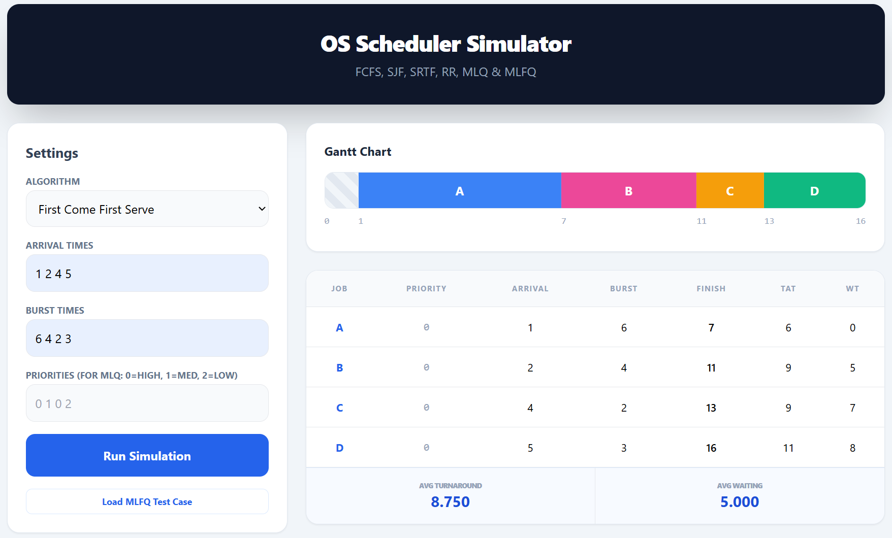
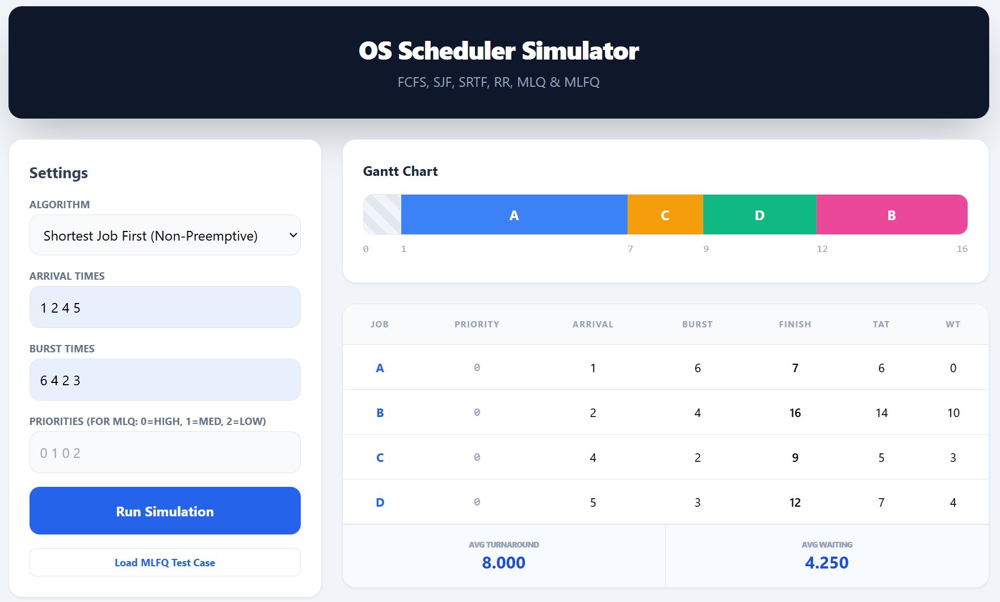
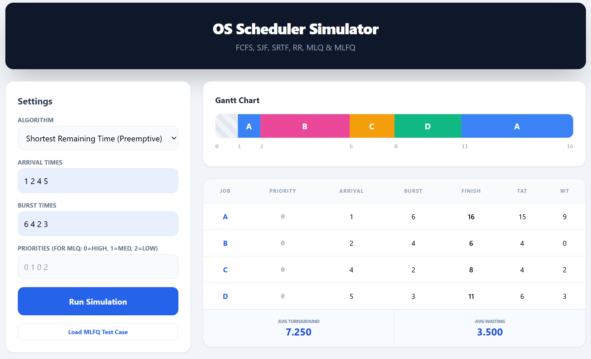
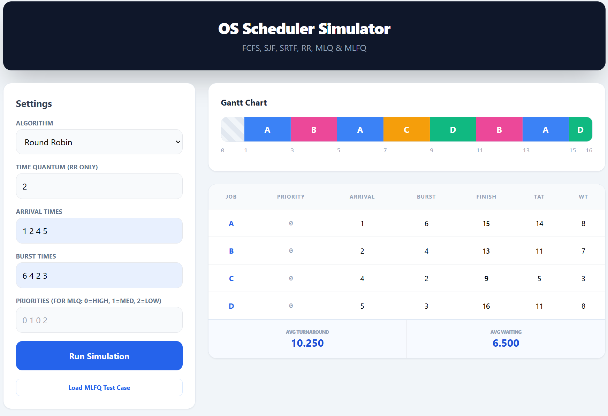
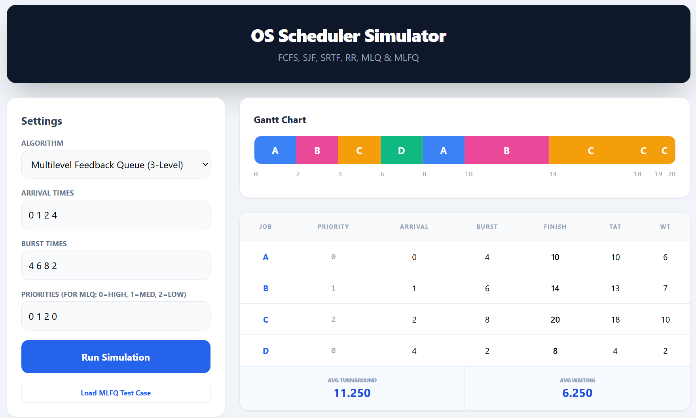

# CPU Scheduling Algorithm Simulator


## Team Members

This project was collaboratively developed by the following team members:

1. **HAN Raby**  
   Student ID: e20220580  

2. **CHEA Chanminea**  
   Student ID: e20220335  

3. **HENG Oulong**  
   Student ID: e20221390  

4. **LIM Kity**  
   Student ID: e20221479  

---

## Video
https://www.youtube.com/watch?v=VxEWCPKL528


## Table of Contents

- [CPU Scheduling Algorithm Simulator](#cpu-scheduling-algorithm-simulator)
  - [Team Members](#team-members)
  - [Video](#video)
  - [Table of Contents](#table-of-contents)
  - [Project Overview](#project-overview)
  - [Project Objectives](#project-objectives)
  - [Key Features](#key-features)
  - [Algorithms Implemented](#algorithms-implemented)
  - [Performance Metrics](#performance-metrics)
  - [Sample Input Scenario](#sample-input-scenario)
  - [Algorithm Comparison](#algorithm-comparison)
  - [How to Run the Project](#how-to-run-the-project)
  - [Screenshots](#screenshots)
  - [Challenges Faced](#challenges-faced)
  - [Conclusion](#conclusion)

---

## Project Overview

The CPU Scheduling Algorithm Simulator is a concise, web-based educational application developed to illustrate the operational behaviour of classical and contemporary CPU scheduling strategies. The simulator presents each scheduling decision visually through an interactive Gantt chart and reports quantitative performance metrics for systematic analysis.

## Project Objectives

- Demonstrate the scheduling order and temporal execution of processes under multiple algorithms.
- Provide accurate computation of per-process and aggregate performance metrics (Waiting Time and Turnaround Time).
- Offer an accessible, interactive environment for laboratory exercises and coursework demonstrations in an undergraduate Operating Systems curriculum.

## Key Features

- **Interactive Input Model:** Accepts Arrival Time, Burst Time and Priority for each process; supports dynamic editing of the process table.
- **Gantt Chart Visualization:** Real-time timeline rendering of process execution sequences to facilitate conceptual understanding.
- **Performance Summary:** Per-process Waiting Time (WT) and Turnaround Time (TAT), and overall averages, presented in a tabular summary.
- **Configurable Parameters:** Selectable algorithm modes and a configurable time quantum for Round Robin and MLFQ queue quanta.
- **Priority Support:** Priority values are used by MLQ and MLFQ modes to determine queue assignment and scheduling order.

---

## Algorithms Implemented

1. **First Come First Serve (FCFS)**
  - Non-preemptive scheduling where processes are executed strictly in order of arrival.

2. **Shortest Job First (SJF) — Non‑preemptive**
  - Selects the process with the smallest burst time from the ready set; once started, a process runs to completion.

3. **Shortest Remaining Time (SRT) — Preemptive**
  - At each scheduling decision the process with the least remaining CPU time is selected; preemption occurs when a newly arrived process has a smaller remaining time.

4. **Round Robin (RR)**
  - Time‑shared preemptive scheduling that rotates processes in the ready queue using a fixed time quantum; suited for equitable CPU distribution.

5. **Multilevel Queue (MLQ)**
  - Fixed partitioning into queues according to priority classes; higher priority queues are served preferentially with no dynamic migration between queues.

6. **Multilevel Feedback Queue (MLFQ)**
  - Three-level feedback architecture with distinct time quanta per level, promotion/demotion rules, and an aging mechanism to mitigate starvation while adapting to observed CPU behaviour.

---

## Performance Metrics

The simulator reports the following canonical metrics for each process and their averages.

- Waiting Time (WT): total time a process spends waiting in the ready queue prior to its execution completion.

```text
WT = TAT - BT
```

- Turnaround Time (TAT): interval from arrival to completion of the process.

```text
TAT = CT - AT
```

Where: CT = Completion Time, AT = Arrival Time, BT = Burst Time.

---

## Sample Input Scenario

| Process | Arrival Time | Burst Time | Priority |
|---------:|:------------:|:----------:|:--------:|
| P1       | 0            | 5          | 2        |
| P2       | 1            | 3          | 1        |
| P3       | 2            | 8          | 3        |
| P4       | 3            | 6          | 2        |

This table is provided as a reproducible test case for classroom demonstration and lab exercises. Use the simulator controls to select different algorithms and observe the resultant Gantt chart and metric table.

---

## Algorithm Comparison

| Algorithm | Mode | Preemptive | Typical Behaviour | Suitable For |
|-----------|:----:|:----------:|-------------------|-------------|
| FCFS      | Non‑preemptive | No  | Simple, deterministic order based on arrival | Introductory examples |
| SJF       | Non‑preemptive | No  | Minimizes average waiting time when service times are known | Offline scheduling analysis |
| SRT       | Preemptive     | Yes | Dynamically favours shorter remaining jobs; can reduce average waiting time | Interactive, dynamic workloads |
| RR        | Preemptive     | Yes | Time‑slicing for fairness; response time depends on quantum | Time‑sharing systems |
| MLQ       | Non‑preemptive (per queue) | Mixed | Fixed-priority segregation; strict service order by queue | Systems with distinct job classes |
| MLFQ      | Preemptive (feedback) | Yes | Adaptive priorities, aging to avoid starvation | Systems requiring responsiveness and adaptability |

---

## How to Run the Project

Open the application by loading `index.html` in any modern web browser (for example, Chrome, Edge or Firefox). No build or installation steps are required; the application runs entirely in the browser.

Steps:

1. Launch a web browser.
2. Open the project file `index.html` from the project root.
3. Enter process records (Arrival Time, Burst Time, Priority), select an algorithm, and execute the simulation.

---

## Screenshots












---

## Challenges Faced

- Ensuring numerical precision and consistency in timing calculations across preemptive and non‑preemptive modes.
- Designing an intelligible Gantt chart representation that accurately conveys preemption and context switches.
- Balancing clarity of the interactive interface with the need to present comprehensive performance statistics.

---

## Conclusion

This simulator provides a focused, pedagogically oriented environment for the study of CPU scheduling algorithms. Its visual and quantitative presentation supports laboratory exercises, comparative analysis and classroom demonstrations in an undergraduate Operating Systems course.

---

